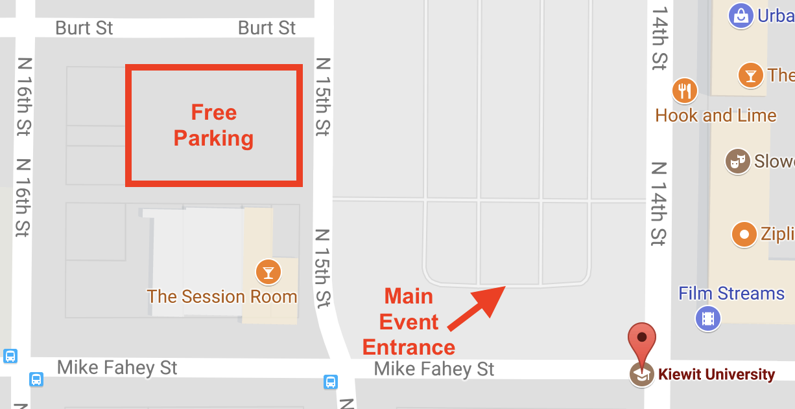

  

# Bridging Big Data (BBD) 2017 Workshop
* ```Date:``` October 4th, 2017, 8:30 to 5 PM
* ```Venue:``` [Kiewit Training Center (Omaha Downtown)](https://goo.gl/maps/a2yv57YTByk)
* ```Location:``` 1450 Mike Fahey St, Omaha, NE 68102
* ```Nearest Airport:``` OMA [Omaha Eppley Airfield](http://www.flyoma.com)

This year BBD workshop is collocated with the [MBDH All-Hands meeting](http://midwestbigdatahub.org/2017-all-hands-meeting/) at the Kiewit Training Center in Downtown Omaha.

# Exit Survey
We value your feedback. Please fill out this [exit survey](https://goo.gl/kWoyE3) if you attended BBD 2017.

# Twitter
Use the hashtag ```#bbdOmaha``` to talk about it and share ideas/pictures/feedback.
[Here are the current tweets.](https://twitter.com/search?q=%23bbdOmaha)


# BBD 2017 Theme
- Bring together **bridge** dataset owners, big data solution providers and leading academics
- Identify opportunities with big data technologies for structural bridge health while addressing the challenges of **data discovery** and **controlled sharing**
- Lead the way to transition bridge structural health data into pipelines that enable data science
- Smart big data pipelines for aging rural bridge transportation infrastructure
- UAV/UAS for Structural Bridge Inspection

# Workshop Focus Areas related to Bridge Structural Health
## Data Management
- Data security and quality; Intellectual Property; Standards and Shared Best Practices; Curation  

## Decision Support Systems
- Analysis and Modeling; Data Analytics; Decision Making; Visualization  

## Social-Technological Impact
- Policy, societal, economic and environmental impact; disaster and crisis management   

## Next-Gen Health Monitoring
- Unmanned Aerial Vehicle/System (UAV/UAS); Sensors; Wireless Networks  

# Agenda
- [Latest Agenda](https://bridgingbigdata.github.io/pages/bbd2017agenda.html)
- Professional Development Units/Continuing Education Credits will be provided to workshop attendees.

# Registration
- [Registration](https://bridgingbigdata.eventbrite.com)

# Parking
- Free parking will be available on the west side of 15th street.
> 

# Hotel
- [Hilton Omaha](http://www3.hilton.com/en/hotels/nebraska/hilton-omaha-OMACVHH/index.html)  
1001 Cass St  
Omaha, NE 68102  
(402) 998-3400  

For **phone** reservations, use the group code ```BDM```.  
[Click here for **online reservations**](https://aws.passkey.com/go/2017BigData), and select ```Attendee``` from the drop down menu.  

Hilton Omaha Google Maps Link: https://goo.gl/maps/EmBbtZzCaAC2

---

# Previous Workshops

## Bridging Big Data Workshop (2016)

* [Workshop held at the Scott Conference center, November 2016](https://bridgingbigdata.github.io/pages/bbd2016.html)


## Bridge-ing Big Data Workshop (2015)

* [Workshop held at the Century Link Conference center, October 2015](http://engineering.unl.edu/bridging-big-data-workshop/)
