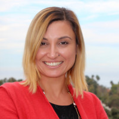

# BBD 2020 Agenda  

### Registration
- Register in advance for this meeting to receive a Zoom Invite:
[https://unomaha.zoom.us/meeting/register/tJYsfuCurDIjHNJM8kp7dPKBmN11xC1u1s7R](https://unomaha.zoom.us/meeting/register/tJYsfuCurDIjHNJM8kp7dPKBmN11xC1u1s7R)  
After registering, you will receive a confirmation email containing information about joining the meeting.

For optimal workshop experience, [please update your zoom installation to the latest version.](https://support.zoom.us/hc/en-us/articles/201362233-Upgrade-update-to-the-latest-version)

## Date
Monday November 9th, 2020, 9:00 A.M. to 3 P.M. Central Time

## Session 1, Keynote: Using Data for Disaster Management
9:00 - 10:00 a.m. CT

**Workshop Kick-off and Speaker Introduction**  
9:00 - 9:15 a.m. CT (10 mins, 5 mins transition time)  
**Topic:** Welcome Remarks  

**Keynote**  
9:15 - 10:00 a.m. CT (30 mins, 15 mins Q&A)     
**Title:** Managing Hazards through Collaborative Data and Artificial Intelligence Workflows
> When it comes to managing hazards and related emergencies, one size does not fit all. A common observation across all hazards is that they are becoming more destructive and frequent making data-driven approaches much needed and time critical. Science-based decisions for hazard mitigation, preparedness, response and recovery need improved dynamic data-driven models. Proactive management to reduce destruction by hazards can be optimized through novel integration of data and models, but it has not yet reached its full potential due to inconsistencies between data, modeling needs, and the actual sensitivities of existing models under changing conditions. To accelerate solutions to such data-driven problems, artificial intelligence enabled data infrastructure and systems to catalog, curate, exchange, analyze, optimize and communicate big data and models at scale are needed. Such science and technology solutions combined with community driven team science approaches are crucial for problem solving in the hazards domain. WIFIRE took the first steps to tackle this problem with a goal to create an integrated system, data and visualization services, and workflows for wildfire monitoring, simulation, and response. Today, WIFIRE provides an end-to-end management infrastructure from the data sensing and collection to artificial intelligence and modeling efforts using a continuum of computing methods that integrate edge, cloud, and high-performance computing. Though this cyberinfrastructure, the WIFIRE project provides community-driven all hazards knowledge for a wide range of public and private sector users enabling scientific, municipal, and educational use. This talk will review some of our recent work on building this dynamic data driven cyberinfrastructure, artificial intelligence solutions, and impactful application solution architectures that showcase integration of a variety of existing technologies and collaborative expertise.      
**Speaker:** Ilkay Altintas, Ph.D., Chief Data Science Officer at San Diego Supercomputer Center  
>   
> Ilkay Altintas is a data and computer scientist, and researcher in the domain of high-performance computing applications. Altintas currently serves as chief data science officer of the San Diego Supercomputer Center (SDSC), at the University of California, San Diego, where she has also is the founder and director of the Workflows for Data Science Center of Excellence (WorDS) and the WIFIRE Lab. Her research objective is the development of methods, cyberinfrastructure and workflows for computational data science and its translation to practical applications. Her WIFIRE Lab aims to be an all hazards knowledge cyberinfrastructure, becoming a management layer from the data collection to modeling efforts including COVID-19, and has achieved significant success in helping to manage wildfires.

**Session Chair:** Deepak Khazanchi

## Break
10:00 – 10:15 a.m. CT (15 mins)        

> Stretch your legs, play with pets, check on kids...just be back by 10:15. You don't want to miss the next session!  

## Session 2, Panel: A view of the crisis from the frontlines
10:15 - 11:00 a.m. CT (45 mins)  

> Panelists will provide latest information on how emergency management and frontline workers are handling the effects of the pandemic and other recent crises (flooding, wind) on their day to day operations and planning for the built environment. How have these things changed? If they have not changed, how likely and in what way can they change in the future?

**Panelists:**
- Josephine Tucker, Senior Manager, Deloitte
- Mark Tryanowicz, Director - Bridge Division, Nebraska Department of Transportation (NDOT)
- Al Nelson, HDR, Inc.
- Paul W. Johnson, Director, Omaha - Douglas County Emergency Management Agency

**Session Chair:** Dan Linzell

## Break
11:00 - 11:15 a.m. CT (15 mins)  

Take a quick poll to express your area of interest for the Breakout session  

> Stretch your legs, play with pets, check on kids...just be back by 11:15. You don't want to miss the next session!  

## Session 3, Breakouts
11:15 - 11:45 a.m. CT (30 minutes each)  

> How are crises affecting our ability to effectively manage infrastructure using Data? What data was needed before? How have data needs changed during the crisis? What data and analytical capabilities are needed to deal with future crises?

#### Engineering Breakout   
11:15 - 11:45 a.m. CT     
**Focus Areas:** Design, Construction, Rehabilitation  
**Facilitators:** Dan Linzell, Samira Ardani  

#### Technology Breakout    
11:15 - 11:45 a.m. CT   
**Focus Areas:** Assessment, Sensors, Simulations  
**Facilitators:** Chungwook Sim, Robin Gandhi, Saeed Yashar Eftekhar

#### Society Breakout  
11:15 - 11:45 a.m. CT  
**Focus Areas:** Policy, Management, Impact   
**Facilitators:** Deepak Khazanchi, Brian Ricks  

#### Summary of Breakouts
11:45 a.m. - 12:00 p.m. CT (15 mins)  

## Lunch Break
12:00 - 1:00 p.m CT (60 mins)
> Stretch your legs, play with pets, check on kids, eat lunch...just be back by 1:00. You don't want to miss the next session!    

## Session 4, Keynote: Future World Vision for Resilient Communities
1:00 to 1:45 p.m. CT (30 mins, 15 mins Q&A)    
**Title:** Future World Vision for Resilient Communities
> From climate change to autonomous vehicles, engineers are confronting a variety of environmental challenges, demographic shifts and technological changes that will require a drastic rethinking of how we build, operate, and maintain our infrastructure systems. Planning for the future is difficult for nearly every organization. ASCE decided to launch the Future World Vision project to help meet this challenge. We compiled and winnowed more than 100 global macrotrends to examine six important sociopolitical, economic, environmental, and technological trends as key drivers of change for future built infrastructure. Our desire is that the Future World Vision project will establish ASCE and civil engineers as bold thought leaders, provide a platform to envision the future built environment and ultimately optimize future system performance and the benefit to society, and be a next‐generation tool that interacts and resonates with those who will create the future built environment—the next generation of civil engineers. The Future World Vision platform is an immersive computer model, using gaming engines, that will create virtual future worlds with evocative visuals, multiple characters and rich narratives that explore holistic city, community and neighborhood systems, including the cultural, social, economic, political, ethical and environmental aspects at different scales. This platform will enable engineers to ask the right questions about a future built environment that doesn’t exist yet, contemplate solutions, postulate the resulting benefit to society – well in advance of starting to design those solutions. This will enable us to better prepare engineers today for possible future needs and challenges.

**Speaker:** Gerald (Jerry) Buckwalter, Chief Operating and Strategy Officer, American Society of Civil Engineers  
>    
> Gerald (Jerry) E. Buckwalter has more than 35 years of varied executive leadership in general management, business development, strategy and innovation, program operations and policy development spanning military, government, international, and commercial domains. He is the Chief Operating and Strategy Officer of ASCE, overseeing all aspects of internal operations including Finance, Administration, Engineering, Lifelong Learning and Human Resources. Prior to joining ASCE, Mr. Buckwalter was a Northrop Grumman Corporate Director of Strategy. His responsibilities included reshaping the company’s business portfolio, mergers and acquisitions, long‐term strategies, innovation initiatives and professional development. Among many distinguished service positions, Mr. Buckwalter was a member for the National Infrastructure Advisory Council reporting to the White House from 2008 to 2012. Mr. Buckwalter earned a degree in Physics from Monmouth University and has extensive continuing education at George Washington University and the Massachusetts Institute of Technology.

**Session Chair:** Dan Linzell

## Break
1:45 – 2:00 p.m. CT (15 mins)         

> Stretch your legs, play with pets, check on kids...just be back by 2:00. You don't want to miss the next session!

## Session 5, Emerging Solutions: Posters and Demonstrations
2:00 - 2:45 p.m CT (45 mins)  

**Session Co-Chairs:** Brian Ricks, Samira Ardani

[Poster/Demonstration Guidelines](https://bridgingbigdata.github.io/pages/bbd2020posterdemo.html)

**Topics:**
* Emmanuel Akintunde, Dan Linzell, **Full-Scale Experiments for Development and Validation of a Robust Damage Detection Tool**, University of Nebraska-Lincoln

* Brandon, O'Brien Chin, Brian Ricks, **A Novel Visualization and Interactive Tool for Bridge Repair Probabilities**, University of Nebraska at Omaha

* [Saeed (Yashar) Azam](https://ceps.unh.edu/person/yashar-eftekhar-azam), **A framework for hybrid nonlinear simulation of bridges with online model updating suitable for hard real‐time computing**, University of New Hampshire

* Jiyoung Lee and Brendan Barnes, **Vision-based Bridge Inspection using Unmanned Aerial Vehicles under Real-time Operation**, University of Nebraska-Lincoln

* Jiyoung Lee and Anoop Mishra, **Rust Recognition on Steel Bridge Members using Onboard Hardware Acceleration**, University of Nebraska-Lincoln and Omaha

* Sepehr Pashoutani, **Fully Automated Ground Penetrating Radar Data Processing Tool for On-Site Assessment of Concrete Bridge Decks**, University of Nebraska-Lincoln

## Closing Remarks: The way forward
2:45 to 3:00 p.m. CT (15 mins)    

**Topic:** Workshop closing comments    
**Speakers:** Dan Linzell and Robin Gandhi  

[Please take this brief survey to provide feedback on the Workshop](https://unomaha.az1.qualtrics.com/jfe/form/SV_elFo6GF4c3AXz9P)

### Registration
- Register in advance for this meeting to receive a Zoom Invite:
[https://unomaha.zoom.us/meeting/register/tJYsfuCurDIjHNJM8kp7dPKBmN11xC1u1s7R](https://unomaha.zoom.us/meeting/register/tJYsfuCurDIjHNJM8kp7dPKBmN11xC1u1s7R)  
After registering, you will receive a confirmation email containing information about joining the meeting.

For optimal workshop experience, [please update your zoom installation to the latest version.](https://support.zoom.us/hc/en-us/articles/201362233-Upgrade-update-to-the-latest-version)
