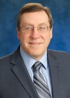

# BBD 2020 Agenda  
### DRAFT, updated Oct 9th, 2020. Talks and times subject to changes.

## Date
Monday November 9th, 2020, 9:00 A.M. to 3 P.M. Central Time

## Session 1, Keynote: Using Data for Disaster Management
9:00 - 10:00 a.m.

**Workshop Kick-off and Speaker Introduction**  
9:00 - 9:15 a.m. (10 mins, 5 mins transition time)  
**Topic:** Welcome Remarks  
**Speaker:** TBD <!--[xxx](link) -->

**Keynote**  
9:15 - 10:00 a.m. (30 mins, 15 mins Q&A)     
**Topic:** Using Data for Disaster Management      
**Speaker:** Ilkay Altintas, Ph.D., Chief Data Science Officer at San Diego Supercomputer Center
>   
> Dr. Ilkay Altintas is the Chief Data Science Officer at the San Diego Supercomputer Center (SDSC), UC San Diego, where she is also the Founder and Director for the Workflows for Data Science Center of Excellence. Her passion is leading collaborative multi-disciplinary computational data science teams. Her research objective is delivering impactful results through making collaborative computational data science work more reusable, programmable, scalable and reproducible. Her work has been applied to many scientific and societal domains including bioinformatics, geoinformatics, high-energy physics, multi-scale biomedical science, smart cities, and smart manufacturing.
> Since joining SDSC in 2001, she has translated her technical and management skills to scientific computing and data science as both a principal investigator and leader. Her research portfolio includes a wide range of cross-disciplinary projects. She is a co-initiator of the popular open-source Kepler Scientific Workflow System, and the co-author of publications related to computational data science at the intersection of workflows, provenance, distributed computing, big data, reproducibility, and software modeling in many different application areas. She is also a well-known MOOC instructor in the field of “big” data science, and reached out to hundreds of thousands of learners across any populated part of our continent. She likes asking the question ‘what if?’ and has been often called an ‘outside of the box thinker’. Among the awards she has received are the 2015 IEEE TCSC Award for Excellence in Scalable Computing for Early Career Researchers and the 2017 ACM SIGHPC Emerging Woman Leader in Technical Computing Award. Her Ph.D. degree is from the University of Amsterdam in the Netherlands with an emphasis on provenance of workflow-driven collaborative science. She is an associate research scientist at UC San Diego.

**Session Chair:** Deepak Khazanchi

## Break
10:00 – 10:15 a.m. (15 mins)        

> Stretch your legs, play with pets, check on kids...just be back by 10:15. You don't want to miss the next session!  

## Session 2, Panel: A view of the crisis from the frontlines
10:15 - 11:00 a.m. (45 mins)  

> Panelists will provide latest information on how emergency management and frontline workers are handling the effects of the pandemic and other recent crises (flooding, wind) on their day to day operations and planning for the built environment. How have these things changed? If they have not changed, how likely and in what way can they change in the future?

**Speakers:**
- Paul W. Johnson, Director, Omaha - Douglas County Emergency Management Agency
- Mark Tryanowicz, Director - Bridge Division, Nebraska Department of Transportation (NEDOT)
- Speaker 3, title, affiliation
- Speaker 4, title, affiliation

**Session Chair:** Dan Linzell

## Break
11:00 - 11:15 a.m. (15 mins)  

Take a quick poll to express your area of interest for the Breakout session  

> Stretch your legs, play with pets, check on kids...just be back by 11:15. You don't want to miss the next session!  

## Session 3, Breakouts
11:15 - 11:45 a.m. (30 minutes each)  

> How are crises affecting our ability to effectively manage infrastructure using Data? What data was needed before? How have data needs changed during the crisis? What data and analytical capabilities are needed to deal with future crises?

#### Engineering Breakout   
11:15 - 11:45 a.m.    
**Focus Areas:** Design, Construction, Rehabilitation  
**Facilitators:** Dan Linzell, Samira Ardani  

#### Technology Breakout    
11:15 - 11:45 a.m.  
**Focus Areas:** Assessment, Sensors, Simulations  
**Facilitators:** Chungwook Sim, Robin Gandhi, Saeed Yashar Eftekhar

#### Society Breakout  
11:15 - 11:45 a.m.  
**Focus Areas:** Policy, Management, Impact   
**Facilitators:** Deepak Khazanchi, Brian Ricks  

#### Summary of Breakouts
11:45 a.m. - 12:00 p.m. (15 mins)  

## Lunch Break
12:00 - 1:00 p.m (60 mins)
> Stretch your legs, play with pets, check on kids, eat lunch...just be back by 1:00. You don't want to miss the next session!    

## Session 4, Keynote: Future World Vision for Resilient Communities
1:00 to 1:45 p.m. (30 mins, 15 mins Q&A)    
**Topic:** Future World Vision for Resilient Communities
> From climate change to autonomous vehicles, engineers are confronting a variety of environmental challenges, demographic shifts and technological changes that will require a drastic rethinking of how we build, operate, and maintain our infrastructure systems. Planning for the future is difficult for nearly every organization. ASCE decided to launch the Future World Vision project to help meet this challenge. We compiled and winnowed more than 100 global macrotrends to examine six important sociopolitical, economic, environmental, and technological trends as key drivers of change for future built infrastructure. Our desire is that the Future World Vision project will establish ASCE and civil engineers as bold thought leaders, provide a platform to envision the future built environment and ultimately optimize future system performance and the benefit to society, and be a next‐generation tool that interacts and resonates with those who will create the future built environment—the next generation of civil engineers. The Future World Vision platform is an immersive computer model, using gaming engines, that will create virtual future worlds with evocative visuals, multiple characters and rich narratives that explore holistic city, community and neighborhood systems, including the cultural, social, economic, political, ethical and environmental aspects at different scales. This platform will enable engineers to ask the right questions about a future built environment that doesn’t exist yet, contemplate solutions, postulate the resulting benefit to society – well in advance of starting to design those solutions. This will enable us to better prepare engineers today for possible future needs and challenges.

**Speaker:** Gerald (Jerry) Buckwalter, Chief Operating and Strategy Officer, American Society of Civil Engineers  
>    
> Gerald (Jerry) E. Buckwalter has more than 35 years of varied executive leadership in general management, business development, strategy and innovation, program operations and policy development spanning military, government, international, and commercial domains. He is the Chief Operating and Strategy Officer of ASCE, overseeing all aspects of internal operations including Finance, Administration, Engineering, Lifelong Learning and Human Resources. Prior to joining ASCE, Mr. Buckwalter was a Northrop Grumman Corporate Director of Strategy. His responsibilities included reshaping the company’s business portfolio, mergers and acquisitions, long‐term strategies, innovation initiatives and professional development. Among many distinguished service positions, Mr. Buckwalter was a member for the National Infrastructure Advisory Council reporting to the White House from 2008 to 2012. Mr. Buckwalter earned a degree in Physics from Monmouth University and has extensive continuing education at George Washington University and the Massachusetts Institute of Technology.

**Session Chair:** Dan Linzell

## Break
1:45 – 2:00 p.m. (15 mins)         

> Stretch your legs, play with pets, check on kids...just be back by 2:00. You don't want to miss the next session!

## Session 5, Emerging Solutions: Posters and Demonstrations
2:00 - 2:45 p.m (45 mins)  

**Session Co-Chairs:** Brian Ricks, Samira Ardani

[Poster/Demonstration Guidelines](https://bridgingbigdata.github.io/pages/bbd2020posterdemo.html)

**Topics:** Coming soon!  

## Closing Remarks: The way forward
2:45 to 3:00 p.m. (15 mins)    

**Topic:** Workshop closing comments    
**Speakers:** Dan Linzell and Robin Gandhi  
